# Task 2: Create database and table in your MySQL server

#### - 運用cmd介面打指令，且建立一個叫做website的database

```sql
create database website;
use website;
```

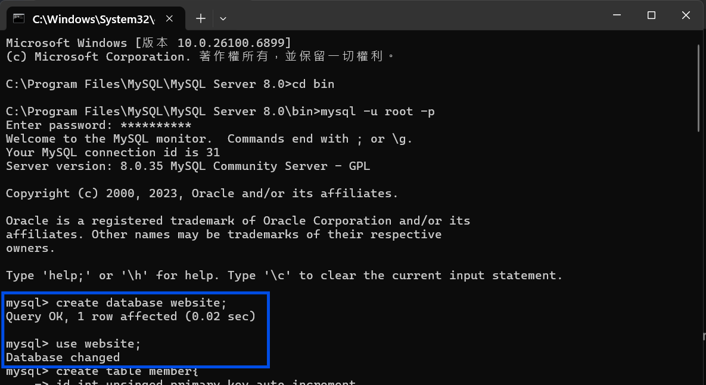

#### - 建立會員資料表

```sql
create table member(
id int unsigned primary key auto_increment,
name varchar(255) not null,
email varchar(255) not null,
password varchar(255) not null,
follower_count int unsigned not null default 0,
time datetime not null default current_timestamp
);
```

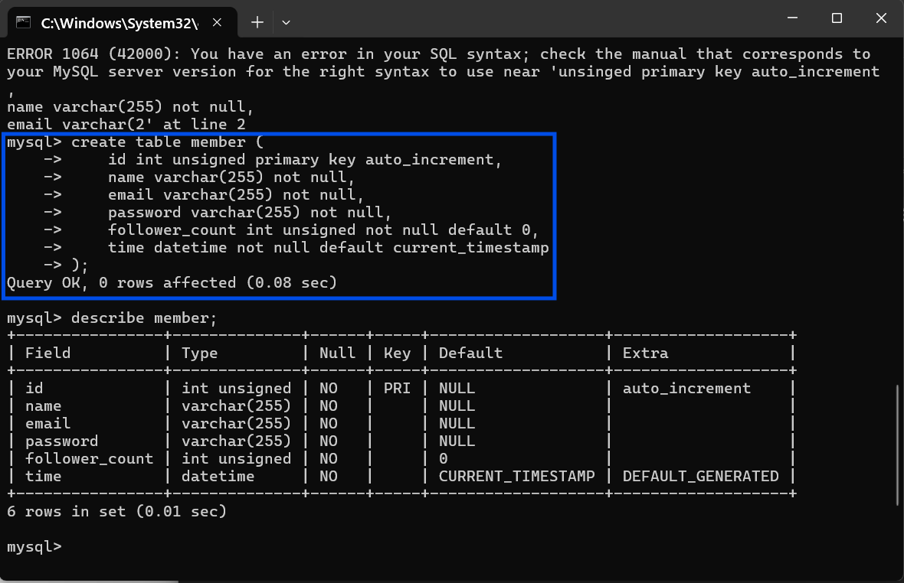

---


# Task 3: SQL CRUD

#### - 建立管理員測試帳號，以及會員測試帳號*4

```sql
insert into member (name, email, password) values ("test", "test@test.com", "test");
insert into member (name, email, password) values 
("member01", "member01@wehelp.tw", "wehelp"),
("member02", "member02@wehelp.tw", "wehelp"),
("member03", "member03@wehelp.tw", "wehelp"),
("member04", "member04@wehelp.tw", "wehelp");
```

#### - 把他們全部select*

```sql
select * from member;
```

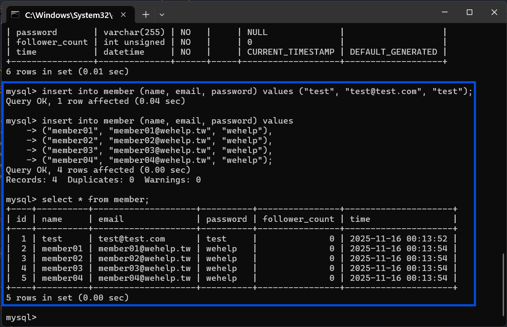

#### - 用時間倒序的方式把會員資料表中的所有資料select出來

```sql
select * from member order by time desc;
```

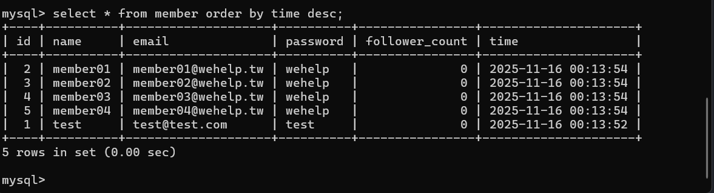

#### - 先用時間倒序的方式把會員資料表排序好之後，跳過第一筆之後再拿三筆出來

```sql
select * from member order by time desc limit 3 offset 1;
```

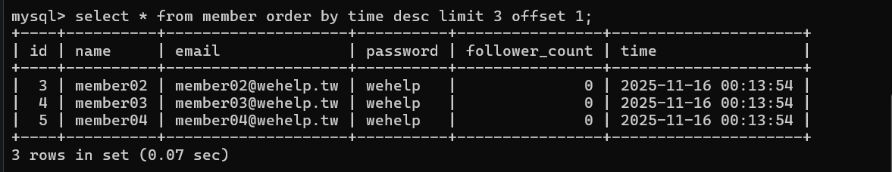

#### - 把email為 <test@test.com> 的資料撈出來

```sql
select * from member where email = "test@test.com";
```

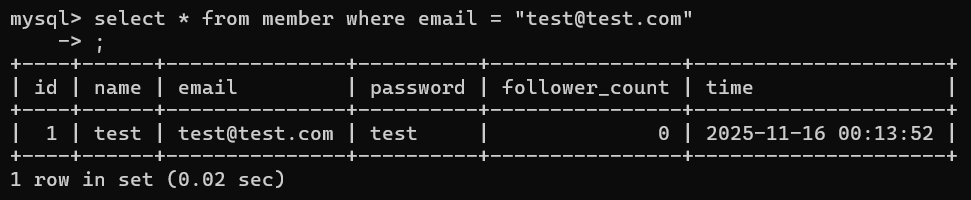

#### - 使用模糊搜尋，把name欄位有es的資料撈出來

```sql
select * from member where name like "%es%";
```

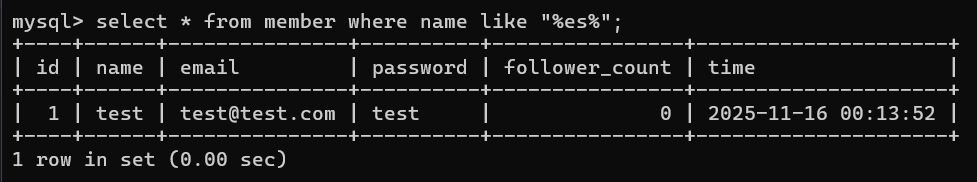

#### - 把email= <test@test.com> 還有密碼=test的資料撈出來

```sql
select * from member where email="test@test.com" and password="test";
```

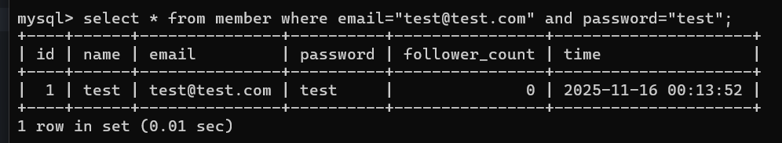

#### - 把email為 <test@test.com> 的資料撈出來，且將其名字改成test2

```sql
update member set name="test2" where email ="test@test.com";
```

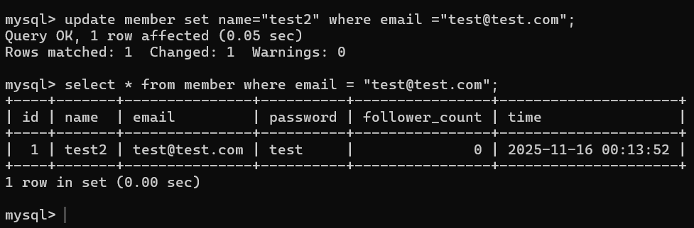

---


# Task 4: SQL Aggregation Functions

#### - 統計總共有幾筆資料from member table

```sql
select count(*) from member;
```

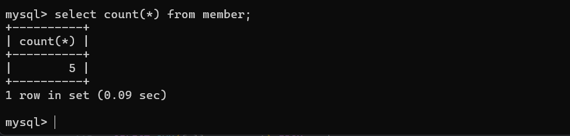

#### - 把member table裡面的所有follower_count欄位加總起來

```sql
select sum(follower_count) from member;
```

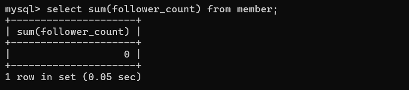

#### - 計算member table裡面的所有follower_count欄位的平均值

```sql
select avg(follower_count) from member;
```

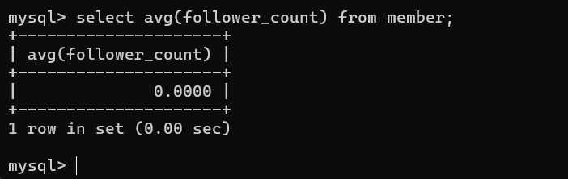

#### - 用追蹤人數倒序（大到小）排完之後，取追蹤人數前兩筆計算平均值（memo子查詢概念）

```sql
select avg(follower_count) as avg_top2
from 
(select follower_count from member order by follower_count desc limit 2) as top2;
```

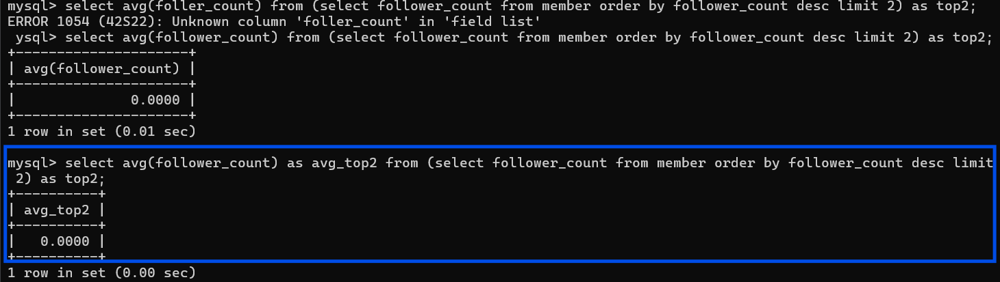

---


# Task 5: SQL JOIN

#### - 創建一個資料表叫做message，並插入假資料

```sql
create table message (
    id int unsigned primary key auto_increment,
    member_id int unsigned not null,
    content text not null,
    like_count int unsigned not null default 0,
    time datetime not null default current_timestamp,
    foreign key (member_id) references member(id)
);
```

```sql
insert into message (member_id, content, like_count) values ("1", "member01@wehelp.tw calling", "1");
insert into message (member_id, content, like_count) values ("2", "member02@wehelp.tw calling", "2");
insert into message (member_id, content, like_count) values ("3", "member03@wehelp.tw calling", "3");
insert into message (member_id, content, like_count) values ("5", "member05@wehelp.tw calling", "5");
insert into message (member_id, content, like_count) values ("4", "member04@wehelp.tw calling", "4");
insert into message (member_id, content, like_count) values ("2", "I caught a cold and kept sneezing. Feel dizzy and fatigue.", "76");
```

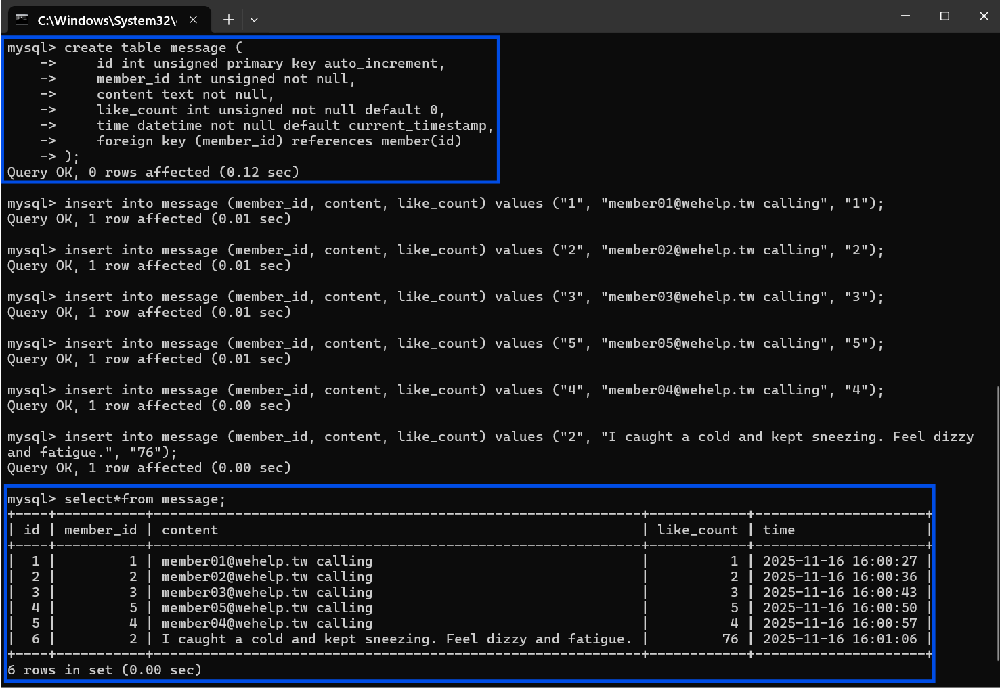

#### - 選取所有訊息，並且join會員資料表去拿到

```sql
select message.content, member.name from message
inner join member on message.member_id = member.id;
```

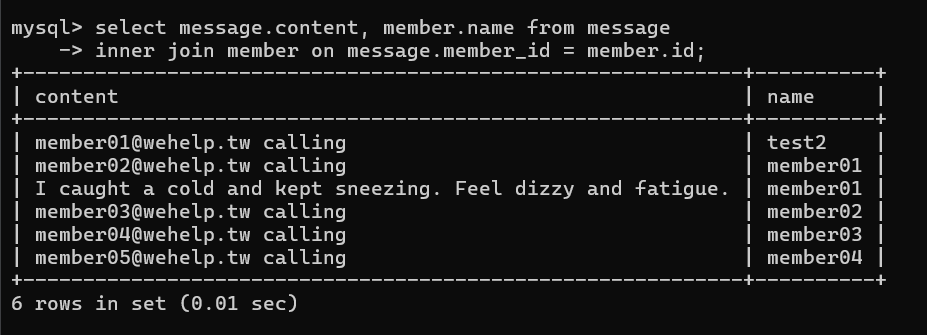

#### - 把寄件者email為 <test@test.com> 的訊息select出來

```sql
select member.name, message.content, member.email from member 
inner join message on member.id = message.member_id 
where member.email='test@test.com';
```

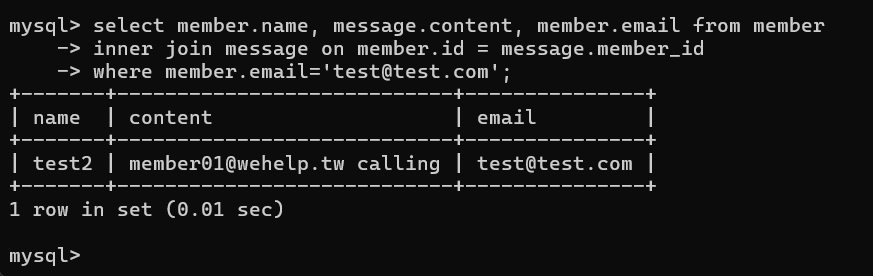

#### - 計算由 <test@test.com>寄出的所有訊息的按讚樹的平均值

```sql
select avg(like_count) from member
inner join message on member.id = message.member_id
where member.email="test@test.com";
```

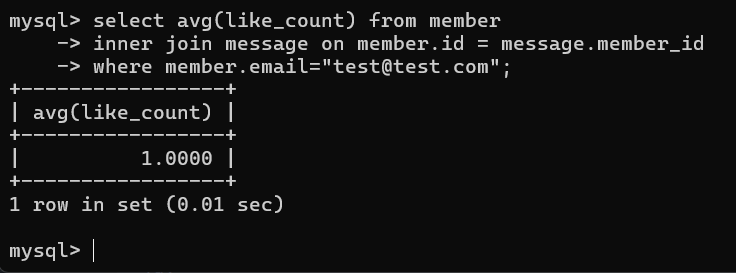

#### - 算每位使用者的平均按讚數並且使用group by

```sql
select member.email, avg(message.like_count)
from message
inner join member on message.member_id = member.id
group by member.email, member.name;
```

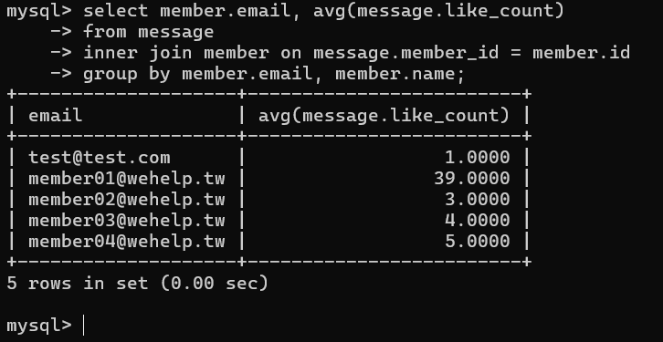